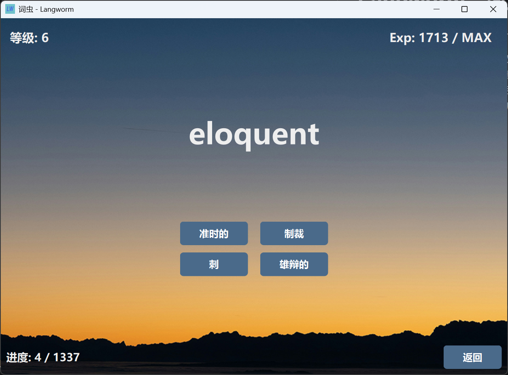

# Langworm - 词虫

一个简洁的单词记忆辅助软件，C++ 课程设计的产物。



原要求如下：屏幕上随机出现一个汉语单词，英语单词，汉语词组，
英语词组或一短句提示小学生给出相应答案，答错了要提示要求重新输入，直到答对为止。
要统计给分，且累计，够一定分数后可进级，即从单词到词组，从词组到短句。
同样，也可降级。软件可扩充，即扩大词库的容量。

## 功能
- [x] 英译中、中译英模式切换
- [x] 难度系统，分为单词、词组、短句、单词拼写、词组拼写和短句拼写六档
- [x] 字典的导入和导出
- [x] 离线数据存储
- [x] 便携式设计，软件数据仅在软件目录内保存

## 下载

[Github Releases](https://github.com/Bluevect/Langworm/releases).

## 编译说明
使用 QtCreator 打开工程可直接编译运行。若在 CLion 中打开，可参考如下配置：

1. 在 `CMake options` 中添加如下参数

```shell
-DCMAKE_PREFIX_PATH="<Qt 目录路径>\6.11.1\mingw_64"
```

2. 在 `Run/Debug Configurations` 中手动设置 `PATH`，这是因为**可能**跟系统 `PATH` 里的其他 MinGW 环境冲突

```shell
PATH="<Qt 目录路径>\\6.11.1\\mingw_64\\bin;%PATH%"
```

编译结束后需手动将 `./config` 复制进编译目录内，否则无法运行

## Credits
- 使用了 [Qt 框架](https://www.qt.io/) 开发
- 背景图片来自 [Unsplash](https://unsplash.com/photos/mountain-range-silhouette-at-sunset-above-clouds-_zkQBgeX4EI)，由 Claudio Schwarz 创作
